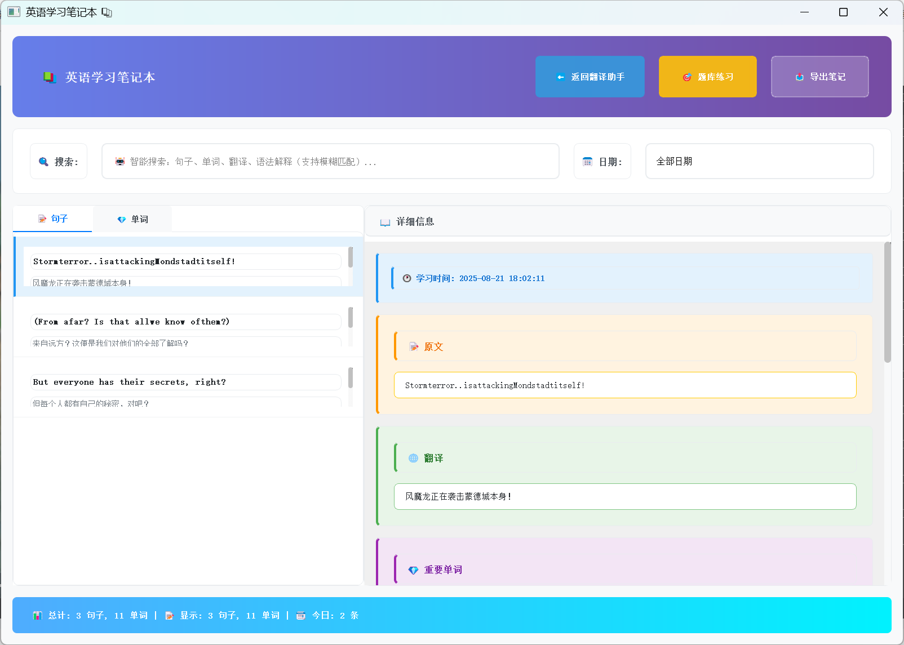
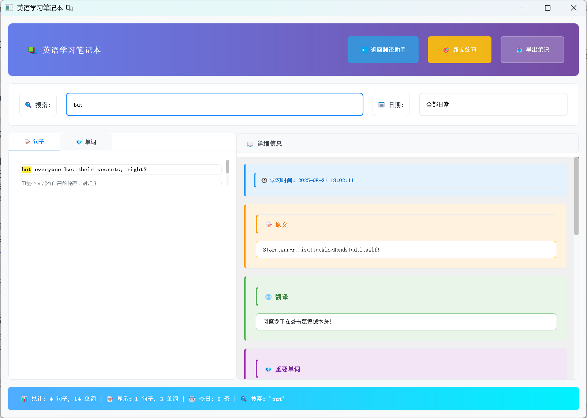
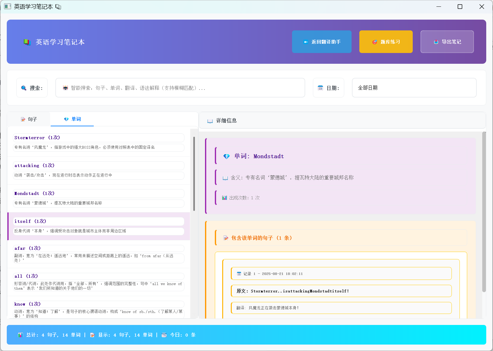
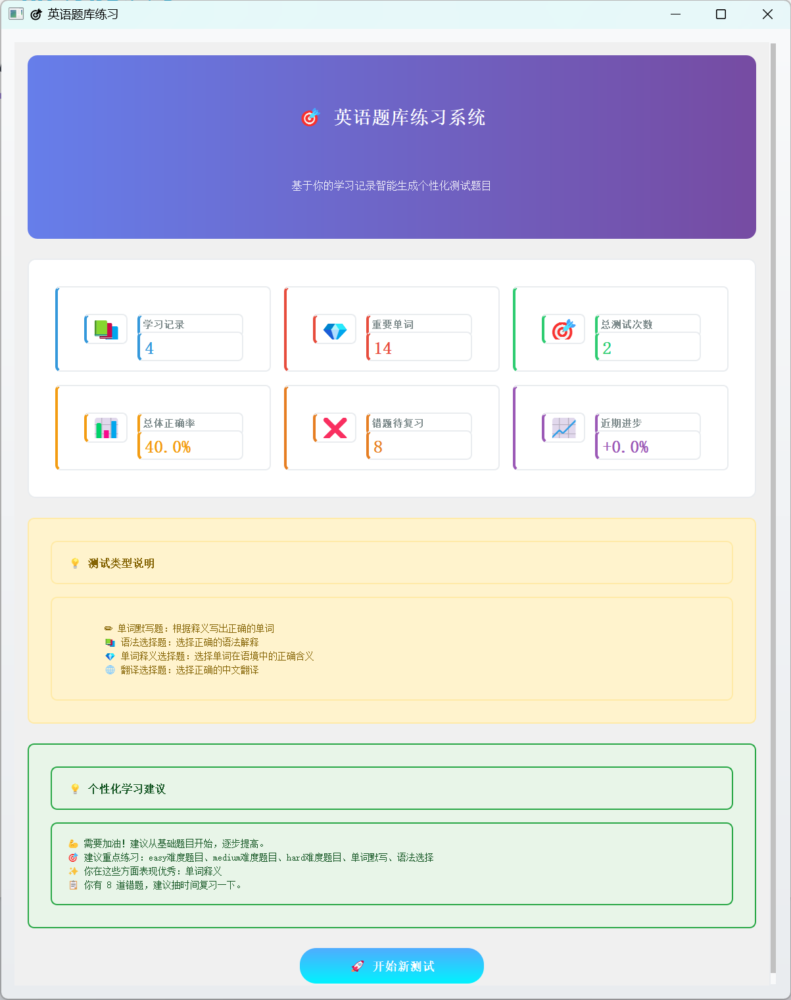
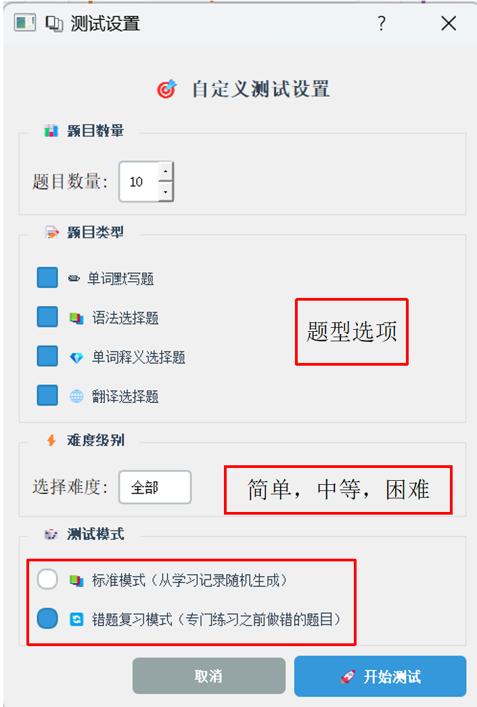
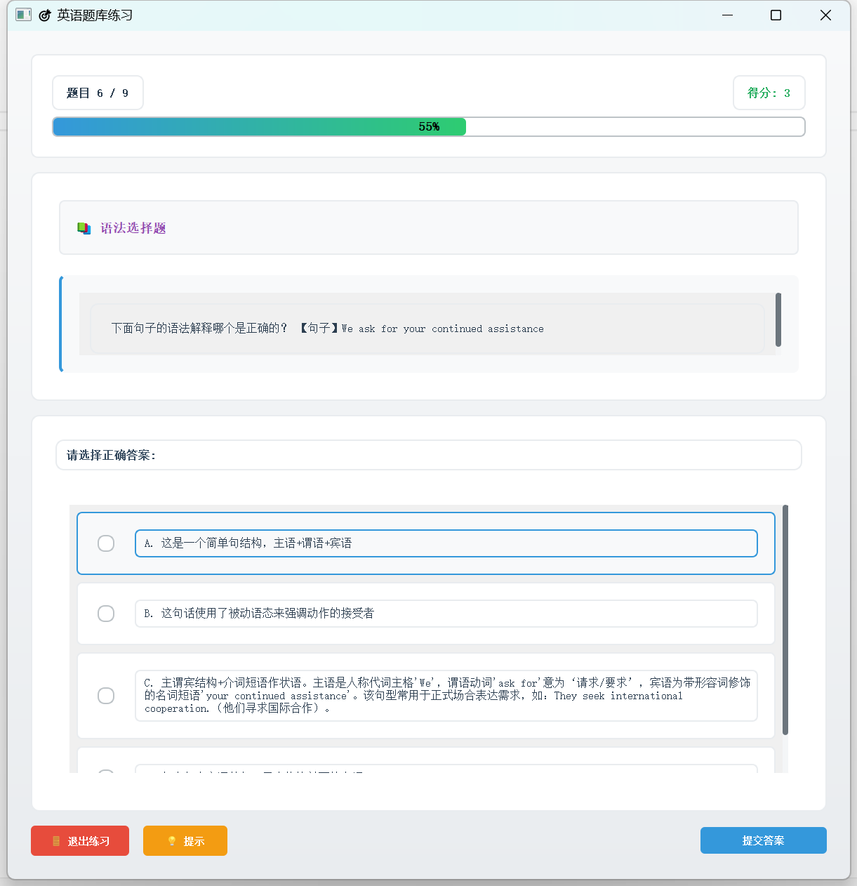

# 🎮 二游英语翻译助手 (Game English Learning Assistant)

基于星火大模型的二次元游戏实时英语翻译学习软件，支持原神等游戏的英文文本翻译与学习。

## ✨ 主要功能

- **实时屏幕截图翻译** - 自动识别游戏内英文文本并翻译
- **智能词汇分析** - 根据用户英语水平（初级/中级/高级）提供个性化的单词解析
- **语法详解** - 智能识别句子中的语法要点并进行解释
- **专有名词识别** - 自动识别游戏专有名词并使用官方译名
- **学习笔记管理** - 自动保存翻译记录，支持搜索和复习
- **RAG检索增强** - 相似句子智能匹配，减少API调用
- **题库练习** - 基于学习记录生成测验题目

## 🏗️ 项目架构

```
genshin-translator-github/
├── app/                          # 应用主模块
│   ├── main.py                  # 主入口
│   ├── managers/                # 管理器模块
│   │   ├── config_manager.py   # 配置管理
│   │   ├── rag_manager.py      # RAG检索管理
│   │   ├── special_terms_manager.py  # 专有名词管理
│   │   └── notes_manager.py    # 笔记管理
│   ├── utils/                   # 工具模块
│   │   └── fuzzy_search_engine.py  # 模糊搜索
│   ├── threads/                 # 线程模块
│   │   ├── processing_thread.py    # OCR处理线程
│   │   └── text_correction_thread.py  # 文本修正线程
│   └── ui/                      # UI组件
│       ├── main_window.py      # 主窗口
│       ├── translation_window.py  # 翻译窗口
│       ├── notes_window.py     # 笔记窗口
│       └── ...                 # 其他UI组件
│
├── llm/                         # LLM模块
│   ├── call_api.py             # API调用
│   └── prompt_manager.py       # 提示词管理
│
├── ocr/                         # OCR模块
│   └── ocr_download.py         # PaddleOCR封装
│
├── rag/                         # RAG检索模块
│   ├── index_construction.py   # 索引构建
│   └── data/                   # 数据文件
│       └── words.json          # 专有名词库
│
├── quiz/                        # 题库模块
│   ├── quiz_generator.py       # 题目生成
│   └── quiz_window.py          # 练习窗口
│
├── run.py                       # 启动脚本
├── requirements.txt             # 依赖列表
└── config.json                  # 配置文件
```

## 🚀 快速开始

### 1. 环境要求

- Python 3.8+
- Windows 10/11
- 星火大模型API密钥

### 2. 安装依赖

#### 2.1 安装PaddlePaddle GPU版本（推荐）

安装PaddlePaddle-GPU依赖可以参考官方网站：[PaddleOCR快速开始](https://www.paddleocr.ai/main/quick_start.html)

**如果GPU支持CUDA版本大于等于12.6**，可以使用下面的命令安装：

```bash
pip install paddlepaddle-gpu==3.1.1 -i https://www.paddlepaddle.org.cn/packages/stable/cu126/
```

**如果CUDA版本小于12.6**，请访问[PaddlePaddle官网](https://www.paddleocr.ai/main/quick_start.html)查找适合你CUDA版本的安装命令。

#### 2.2 安装其他依赖

安装完PaddlePaddle后，执行：

```bash
pip install -r requirements.txt
```

> **注意**: 首次运行会自动下载OCR模型（约200MB），请确保网络连接正常。

### 3. 配置API密钥

编辑 `config.json`，填入你的大模型API密钥：

```python
  "llm": {
    "base_url": "https://spark-api-open.xf-yun.com/v1",
    "api_key": "your-api-key-here",
    "model": "4.0Ultra"
  }
```

### 4. 运行程序

```bash
python run.py
```

## 📖 使用说明

### 基本使用流程

1. **启动程序** - 运行 `run.py`
2. **设置截图区域** - 点击"设置截图区域"，输入游戏对话框坐标
3. **选择英语水平** - 选择初级/中级/高级
4. **启动翻译窗口** - 点击"启动翻译窗口"
5. **开始翻译** - 点击"快速截图"或使用快捷键

### 功能特点

#### 🎯 个性化学习
根据用户英语水平提供不同难度的词汇和语法解析：
- **初级**: 基础词汇、简单语法
- **中级**: 中等难度词汇、复合句分析
- **高级**: 高级词汇、复杂语法结构

#### 📚 学习笔记
- 自动保存每次翻译记录
- 支持模糊搜索（句子、单词、翻译、语法）
- 统计学习次数和单词频率
- 导出笔记功能

#### 🔍 RAG检索
- 自动检测相似历史翻译
- 相似度超过50%直接复用
- 减少API调用，节省费用

#### 🎮 题库练习
- 基于学习记录生成测验
- 支持多种题型
- 追踪学习进度

## 💡 技术特性

- **模块化架构** - 清晰的代码结构，易于维护和扩展
- **多线程处理** - OCR和翻译在后台进行，UI保持响应
- **智能提示词** - 根据用户水平动态生成最适合的提示词
- **专有名词库** - 内置原神等游戏专有名词对照表
- **PyQt5界面** - 现代化的图形用户界面

## 📦 依赖说明

主要依赖：
- `PyQt5` - GUI框架
- `paddlepaddle` & `paddlex` - OCR引擎
- `openai` - LLM API调用
- `langchain` & `faiss-cpu` - RAG检索
- `sentence-transformers` - 文本嵌入

完整依赖见 `requirements.txt`

## 🔧 配置说明

### config.json
```json
{
  "x": 0,           // 截图起始X坐标
  "y": 1121,        // 截图起始Y坐标
  "width": 2559,    // 截图宽度
  "height": 318,    // 截图高度
  "user_level": "中级",  // 用户英语水平
  "font_size": 22,      // 翻译显示字体大小
  "zoom_scale": 100,    // 窗口缩放比例
  "llm": {              // LLM配置
    "base_url": "https://api.openai.com/v1",  // API地址
    "api_key": "your-api-key",                // API密钥
    "model": "gpt-4"                          // 模型名称
  }
}
```

## 📝 开发说明

### 添加新的用户水平

编辑 `llm/prompt_manager.py`：

```python
TRANSLATION_PROMPTS = {
    "初级": "...",
    "中级": "...",
    "高级": "...",
    "专家级": "..."  # 添加新水平
}

VALID_LEVELS = ["初级", "中级", "高级", "专家级"]
```

### 添加新的专有名词

编辑 `rag/data/words.json`：

```json
[
  {
    "en": "Mondstadt",
    "zhCN": "蒙德"
  },
  {
    "en": "NewTerm",
    "zhCN": "新术语"
  }
]
```

## 产品效果

<div align="center">

渲染的UI界面


笔记本



搜索功能



单词复习



题库







</div>

## 🎯 未来计划

- [ ] 支持更多游戏的专有名词库
- [ ] 添加语音朗读功能
- [ ] 多语言翻译支持

## 📄 许可证

本项目仅供学习和研究使用。

## 🤝 贡献

欢迎提交Issue和Pull Request！

## 📞 联系方式

如有问题或建议，欢迎通过GitHub Issues联系。

---

**注意**: 
- 本项目需要星火大模型API密钥才能正常使用翻译功能
- 首次运行会自动下载OCR模型（约200MB）
- 建议在Windows环境下使用

⭐ 如果这个项目对你有帮助，请给一个Star！
